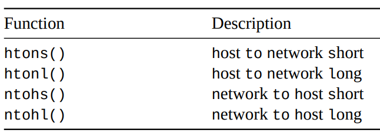
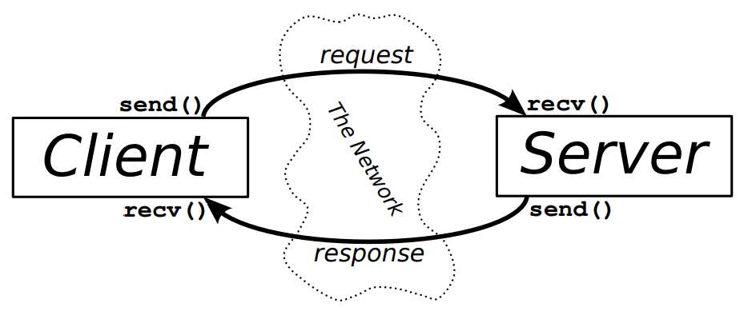

[Socket Programming Book](https://beej.us/guide/bgnet/pdf/bgnet_usl_c_1.pdf)

# What is a socket

- when Limux does any sort of I/O, it does it by reading/writing to a file descriptor

>- a **file descriptor (fd)** is an integer associated with an open file (everything in Unix is a file, including a network connection)

- you get the fd by calling `int fd = socket();`, then use `send()` `recv()` to "write/read" to the network

## Internet Sockets

Datagram Sockets `SOCK_DGRAM`

- may arrive, may arrive out of order, if it arrives it will be error-free

- uses UDP 

- "connectionless" since you send out the packet with an IP header on it with destination info

- used when losing some packets doesn't really matter

Stream Sockets `SOCK_STREAM`

- *reliable* 2-way connections (if you output "1, 2" into the socket, it will be recieved as "1, 2" at the other end)

- used by ssh, HTML uses stream sockets to get pages

- use the TCP protocol which ensures data arrives sequentially without errors (IP mainly deals with internet routing)

> **MAYBE WANT TO READ 2.2 IF EXTRA TIME**

# 3: IP Addresses

IPv4 uses 32 bits to represent an IP address

- `192.0.2.33`

- in IPv6 `::ffff:192.0.2.33`

but we ran out because so IPv6 uses 128 bits

- `2001:0db8:c9d2:0012:0000:0000:0000:0051`

- compress 0's with 2 ":" `2001:db8:c9d2:12::51`

## 3.1 Port Numbers

TCP uses IP address AND **port number**

- 16-bit number that is the "local address" for the connection

- ex. IP address is the apartment address, port number is the unit number

## 3.2 Byte Order

There are 2 byte orderings. say we want to represent a 2-byte hex number (`b34f`)

- **Big-Endian** stores in sequential bytes: `b3`, `4f` (most important information first)

- **small-endian** stores reversed: `b3`, `4f`
  - usually computers with intel processors

Your computer stores in *host byte order*. When you are filling out packets, you have to make sure your 2/4-byte numbers follow *network byte order*

- always run the value through a function to set it to network byte order (assume host is wrong)



- convert back to host byte order when you recieve data

## 3.3 Structs

```C++
int socket_descriptor = socket();
```

### `struct addrinfo`

```C++
struct addrinfo {
  int ai_flags; // AI_PASSIVE, AI_CANONNAME, etc.
  int ai_family; // AF_INET, AF_INET6, AF_UNSPEC
  int ai_socktype; // SOCK_STREAM, SOCK_DGRAM
  int ai_protocol; // use 0 for "any"
  size_t ai_addrlen; // size of ai_addr in bytes
  struct sockaddr *ai_addr; // struct sockaddr_in or _in6
  char *ai_canonname; // full canonical hostname
  struct addrinfo *ai_next; // linked list, next node
};
```

- `getaddrinfo()` returns a pointer to a new linked list of `struct addrinfo` which contains info about a socket addr

### `struct sockaddr`

```C++
struct sockaddr {
  unsigned short sa_family; // address family, AF_xxx
  char sa_data[14]; // 14 bytes of protocol address
};
```

- `sa_family` = `AF_INET` (IPv4) or `AF_INET6` (IPv6) for our purposes 
- `sa_data` contains destination are & port # for the socket, BUT this is tedious to unpack by hand so use...

```C++
// (IPv4 only--see struct sockaddr_in6 for IPv6)
struct sockaddr_in {
  short int sin_family; // Address family, AF_INET
  unsigned short int sin_port; // Port number
  struct in_addr sin_addr; // Internet address
  unsigned char sin_zero[8]; // Same size as struct sockaddr
};
```

- a `sockaddr_in` ptr can be cast to a `sockaddr` ptr (and vice versa)
- `sin_port` must be in network byte order
- *Note: `sin_zero` should be set to all 0 using `memset()` & is used to pad the struct to the same size as `sockaddr`*

what is the `sin_addr`?

```C++
// (IPv4 only--see struct in6_addr for IPv6)
// Internet address (a structure for historical reasons)
struct in_addr {
  uint32_t s_addr; // that's a 32-bit int (4 bytes)
};
```

```C++
struct sockaddr_storage {
sa_family_t ss_family; // address family
// all this is padding, implementation specific, ignore it:
char __ss_pad1[_SS_PAD1SIZE];
int64_t __ss_align;
char __ss_pad2[_SS_PAD2SIZE];
};
```

- this struct is basically `struct sockaddr`, but it's large enough to hold both IPv4 and IPv6 addrs, so you can fill this out, then cast as appropriate

## More IP Addrs

If you have an IP addr (ex. `10.12.110.57` or `2001:db8:63b3:1::3490`) you can use `inet_pton()` 

- pton stands for **printable to network**

- returns -1 or 0 if invalid; check value is >0 before using

```C++
struct sockaddr_in sa; // IPv4
struct sockaddr_in6 sa6; // IPv6
inet_pton(AF_INET, "10.12.110.57", &(sa.sin_addr)); // IPv4
inet_pton(AF_INET6, "2001:db8:63b3:1::3490", &(sa6.sin6_addr)); // IPv6
```

# 5: System Calls

## `getaddrinfo()` 

takes human-readable host names and returns a linked-list of `struct addrinfo` (which are all the addrs of the host). you can then iterate through the linked list to find one that suits your needs (ex. IPv4, TCP)

```C++
#include <sys/types.h>
#include <sys/socket.h>
#include <netdb.h>
int getaddrinfo(const char *node, // e.g. "www.example.com" or IP
                const char *service, // e.g. "http" or port number
                const struct addrinfo *hints,
                struct addrinfo **res);
// returns 0 if error
```

## **`socket()`** 

gets the file descriptor

```C++
#include <sys/types.h>
#include <sys/socket.h>
int socket(int domain, int type, int protocol);
        // IPv4/6  stream/datagram   TCP/UDP
```

use them together:

```C++
struct addrinfo hints, *res;

// fill out "hints" struct

// do the lookup
getaddrinfo("www.example.com", "http", &hints, &res);

// ensure that getaddrinfo did not return 0
// iterate through linked list to find valid entry

// get socket descriptor (-1 for error)
int s = socket(res->ai_family, res->ai_socktype, res->ai_protocol); 
```

## `bind()`

- associates a socket with a port on your local machine
- commonly done if you're going to `listen()` for incoming connections on a specific port; the port # is used by the kernel to match an incoming packet to a certain process's socket descriptor

```C++
#include <sys/types.h>
#include <sys/socket.h>
int bind(int sockfd, struct sockaddr *my_addr, int addrlen);
```

- ports below 1024 are reserved
- use ports up to 65535 (given that they aren't being used by another program)

### `SO_REUSEADDR` 

sometimes `bind()` may fail on server restart

- when a TCP connection closes, both ends enter a short-lived `TIME_WAIT` state (allows any lingering data packets to be recieved by the intended recipient)
  
```C++
int yes=1;
if (setsockopt(socket_fd,SOL_SOCKET,SO_REUSEADDR,&yes,sizeof yes) == -1) {
  perror("setsockopt");
  exit(1);
}
```

- enables `SO_REUSEADDR` for every listening socket
  - allows for faster server restart BUT could potentially lead to data packets from the old connection being interpreted as belonging to the new connection (less likely if `TIME_WAIT` timeout is short)

## `connect()` *(client)*

```C++
#include <sys/types.h>
#include <sys/socket.h>

int connect(int sockfd, struct sockaddr *serv_addr, int addrlen);
// fail: returns -1 
```

## `listen()`

```C++
int listen(int sockfd, int backlog); // backlog = # connections allowed in incoming queue
// fail: return -1
```

once `listen()` has been called, the OS will automatically handle TCP handshakes + place connections in a queue 

```C++
getaddrinfo();
socket();
bind();
listen();
/* accept() goes here */
```

## `accept()`

accepts a connection from the queue \
returns a *new socket file descriptor* to use for this *single connection*

```C++
int accept(int sockfd, struct sockaddr *addr, socklen_t *addrlen);
// fail: return -1
```

- `sockfd` = listening socket descriptor
- `addr` = stores new connection info
- `addrlen` = sizeof(struct sockaddr_storage)
  - limits the amount of bytes put into addr
  - changes the value of addrlen if uses <

## `send()` & `recv()`

used to communicate over stream sockets (or connected datagram sockets)

```C++
int send(int sockfd, const void *msg, int len, int flags); 
// sockfd = fd of socket you want to send to
// len = en of data in bytes

int recv(int sockfd, void *buf, int len, int flags); 
// sockfd = fd to read from
// buf = buffer to read the info into

// returns the actual # of bytes sent/read (fail: -1)
//  if recv returns 0, remote side closed their connection on you
```

## `close()` & `shutdown()`

```C++
close(sockfd);
```

stops any more reads/writes to the socket

```C++
int shutdown(int sockfd, int how); // success: 0, fail: -1
```

give more control about how socket is closed
| **`how=`** | **effect**          |
|---------|---------------------|
| 0       | no more receives    |
| 1       | no more sends       |
| 2       | basically `close()` |

>- does not actually close the fd (just changes usability), you still need to `close()` to free it

## `getpeername()` & `gethostname()`

```C++
// tells you who is at the other end of a connected stream socket
int getpeername(int sockfd, struct sockaddr *addr, int *addrlen);
// sockfd = the fd of the connected socket
// addr will store the info
// arrelen = sizeof(struct sockaddr)

int gethostname(char *hostname, size_t size);

// fail: -1
```

# 6: Client-Server Background



